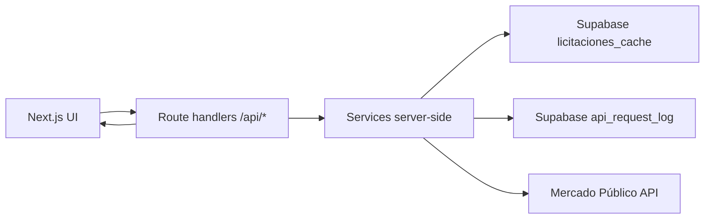

# Radar Licitaciones Chile

Plataforma pública para búsqueda, seguimiento y análisis de licitaciones de Mercado Público Chile.

El proyecto está construido como una base productiva para portfolio y evolución futura: integra Mercado Público server-side, Supabase para cache y persistencia, rate limiting defensivo, dashboard analítico y despliegue en Vercel.

## Screenshots

Agregar capturas reales del proyecto desplegado:

```text
docs/assets/licitaciones-listado.png
docs/assets/dashboard.png
```

## Modulo Ordenes de Compra

La app incluye una seccion `/ordenes-compra` para consultar compras reales del Estado desde Mercado Publico.

Endpoints:

| Endpoint | Uso |
| --- | --- |
| `GET /api/purchase-orders` | Listado paginado y filtrado por `codigo`, `fecha`, `estado`, `q`, `comprador`, `proveedor` |
| `GET /api/purchase-orders/[code]` | Detalle normalizado |
| `GET /api/purchase-orders/[code]/full` | Detalle normalizado + respuesta cruda + cache |

El modulo reutiliza Supabase cache, rate limiting y `api_request_log`. Los recursos registrados son `purchase_orders:list` y `purchase_orders:detail`.

## Tecnologías

- Next.js App Router
- TypeScript
- Tailwind CSS
- Supabase
- Vercel
- pnpm vía Corepack
- Mercado Público / ChileCompra API

## Funcionalidades

- Listado paginado de licitaciones activas.
- Búsqueda por palabra, código, organismo y categoría.
- Filtros por estado, fecha, organismo y rango de monto.
- Detalle de licitación por código.
- Favoritos locales.
- Dashboard con análisis de licitaciones activas.
- Cache server-side en Supabase.
- Rate limiting defensivo para proteger el ticket de Mercado Público.
- Health check operacional.
- Endpoint admin para uso diario de API/cache.

## Arquitectura resumida



La API de Mercado Público nunca se consume desde el navegador. El ticket se usa solo server-side.

## Instalación local

```bash
corepack prepare pnpm@10.24.0 --activate
pnpm install
cp .env.example .env.local
pnpm dev
```

Abrir:

```text
http://localhost:3000
```

## Variables de entorno

```bash
MERCADO_PUBLICO_TICKET=tu_ticket_de_mercado_publico
NEXT_PUBLIC_SUPABASE_URL=https://tu-proyecto.supabase.co
NEXT_PUBLIC_SUPABASE_ANON_KEY=tu_supabase_anon_publishable_key
SUPABASE_SERVICE_ROLE_KEY=tu_service_role_key_solo_servidor
MERCADO_PUBLICO_DAILY_LIMIT=10000
MERCADO_PUBLICO_CACHE_TTL_MINUTES=60
ADMIN_API_KEY=un_valor_largo_privado
```

`SUPABASE_SERVICE_ROLE_KEY` y `ADMIN_API_KEY` son variables privadas de servidor. No deben llevar prefijo `NEXT_PUBLIC`.

## Supabase

Ejecutar el SQL idempotente:

[lib/supabase/schema.sql](./lib/supabase/schema.sql)

Incluye:

- `profiles`
- `favorite_tenders`
- `tender_alerts`
- `licitaciones_cache`
- `api_request_log`
- RLS
- policies idempotentes
- grants para `service_role`, `authenticated` y `anon`

## Endpoints actuales

| Endpoint | Uso |
| --- | --- |
| `GET /api/tenders` | Listado paginado y filtrado |
| `GET /api/tenders/[code]` | Detalle normalizado |
| `GET /api/tenders/[code]/full` | Detalle normalizado + respuesta cruda + cache |
| `GET /api/dashboard/summary` | Resumen analítico |
| `GET /api/health` | Estado operacional |
| `GET /api/admin/api-usage` | Uso diario de API/cache, protegido con `ADMIN_API_KEY` |

## Verificación

```bash
pnpm lint
pnpm typecheck
pnpm build
```

## Documentación

- [Arquitectura](./docs/ARCHITECTURE.md)
- [Deployment](./docs/DEPLOYMENT.md)
- [Rate limiting](./docs/RATE_LIMITING.md)
- [Estructura del proyecto](./docs/PROJECT_STRUCTURE.md)
- [API Mercado Público](./docs/API_MERCADO_PUBLICO.md)
- [Roadmap](./docs/ROADMAP.md)

## Producción

Links a completar:

```text
Producción: https://tu-proyecto.vercel.app
Repositorio: https://github.com/usuario/licitaciones-mercado-publico
```

## Roadmap resumido

- Alertas persistentes por usuario.
- Órdenes de compra.
- Autenticación.
- Analytics históricos.
- IA para clasificación, resumen y recomendación.
- Observabilidad.
- Notificaciones email/WhatsApp.
- App mobile futura.

## Lecciones aprendidas

- En Vercel las variables deben configurarse por ambiente: Production y Preview.
- Local y cloud pueden comportarse distinto por filesystem, red y `.env.local`.
- La API de Mercado Público debe protegerse con cache y rate limiting.
- Supabase RLS requiere grants correctos además de policies.
- `service_role` solo debe usarse server-side.
- `pnpm` con Corepack evita lockfiles inconsistentes.
- En Next.js App Router, las integraciones sensibles deben vivir en route handlers o services server-side.
