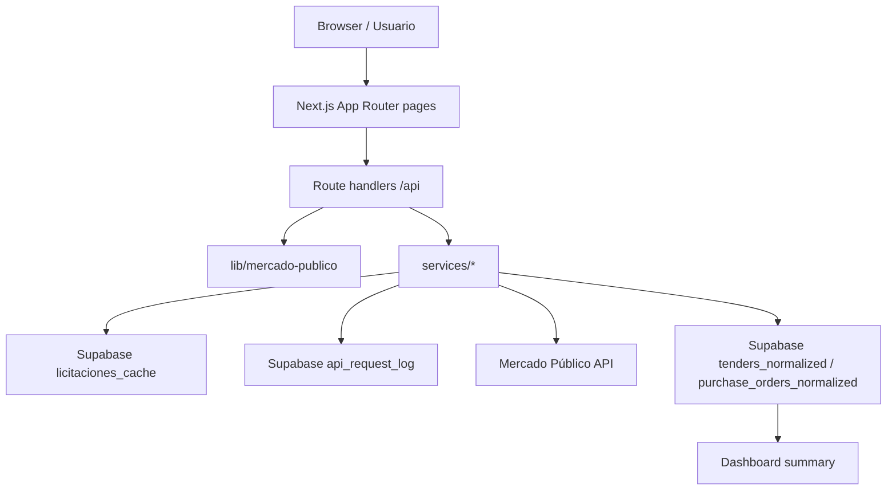
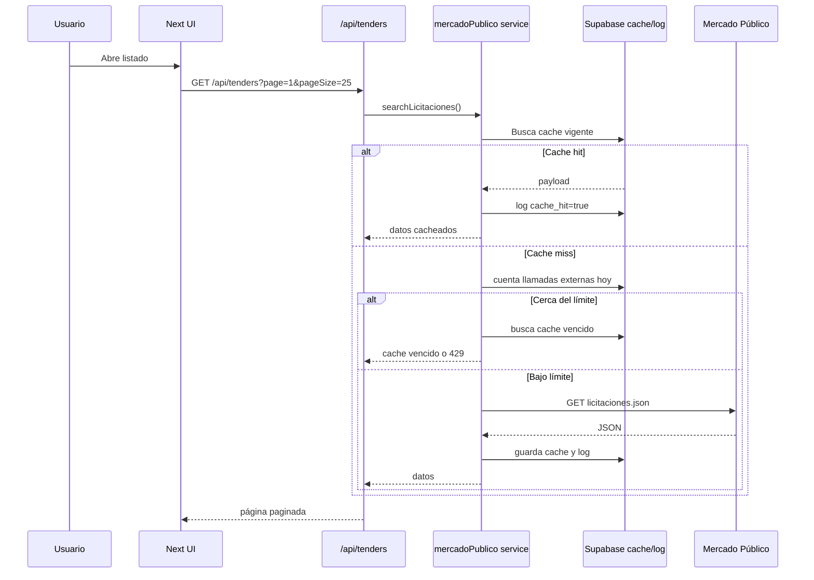
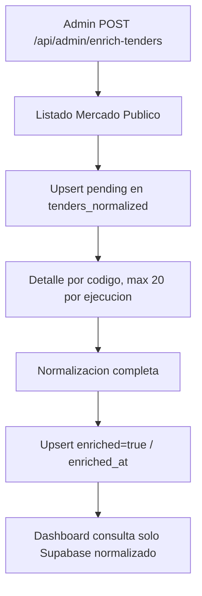
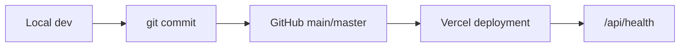

# Arquitectura

Radar Licitaciones Chile es una aplicación Next.js orientada a consultar, cachear y analizar licitaciones públicas de Chile usando Mercado Público y Supabase.

## Objetivos técnicos

- Mantener el ticket de Mercado Público solo en servidor.
- Reducir llamadas externas usando cache.
- Exponer una UI rápida, paginada y responsive.
- Preparar una base limpia para alertas, autenticación, IA y analytics.
- Tener visibilidad operacional con health checks y logs de uso.

## Vista general



## Capas

### Frontend

Responsabilidades:

- Renderizar listado, filtros, favoritos locales y dashboard.
- Mantener interacción responsive.
- No conocer tickets ni service role keys.

Componentes principales:

- `components/tenders-shell.tsx`
- `components/tender-card.tsx`
- `components/filter-panel.tsx`
- `components/main-nav.tsx`

### Backend Next.js

Route handlers en `app/api/**`:

- reciben parámetros HTTP
- validan contexto
- llaman servicios server-side
- devuelven JSON limpio
- transforman errores operativos en códigos HTTP

### Services

`services/mercadoPublico.ts` centraliza llamadas externas, cache y rate limiting.

`services/apiRequestLog.ts` registra uso de API y genera resumen administrativo.

`services/dashboardSummary.ts` calcula KPIs solo desde datos normalizados y enriquecidos en Supabase.

`services/normalizedData.ts` persiste representaciones consistentes de licitaciones y ordenes de compra para analytics.

### Lib

`lib/mercado-publico/*` contiene tipos, normalización y cliente de dominio.

`lib/env.ts` centraliza lectura y validación de variables.

`lib/supabase/schema.sql` define infraestructura de base de datos.

## Flujo request-response



## Integración Mercado Público

La integración usa endpoints públicos de Mercado Público:

- `/publico/licitaciones.json`
- `/publico/ordenesdecompra.json`
- `/Publico/Empresas/BuscarComprador`
- `/Publico/Empresas/BuscarProveedor`

El ticket se agrega solo en `services/mercadoPublico.ts` y nunca se envía al cliente.

## Supabase

Tablas actuales:

- `profiles`
- `favorite_tenders`
- `tender_alerts`
- `licitaciones_cache`
- `api_request_log`
- `tenders_normalized`
- `purchase_orders_normalized`

`SUPABASE_SERVICE_ROLE_KEY` se usa solo desde services server-side para cache/log/health.

## Datos normalizados y enriquecimiento

El listado de Mercado Publico puede venir incompleto. Por eso la app separa cache operativo de datos normalizados.

Flujo de enriquecimiento:



Tablas:

- `tenders_normalized`: licitaciones con comprador, region, fechas, monto interpretado y payload normalizado.
- `purchase_orders_normalized`: ordenes de compra con comprador, proveedor, totales, fechas y payload normalizado.

Campos de control:

- `enriched`: indica si el registro tiene detalle completo normalizado.
- `enriched_at`: fecha de ultimo enriquecimiento completo.
- `normalized`: snapshot JSONB del objeto normalizado usado por la app.

Endpoints administrativos:

- `POST /api/admin/enrich-tenders`
- `POST /api/admin/enrich-purchase-orders`
- `GET /api/admin/enrichment-status`
- `POST /api/admin/cleanup-cache`

Los endpoints de enriquecimiento:

- requieren `ADMIN_API_KEY`
- procesan por defecto 20 detalles por ejecucion
- aceptan `limit` y `batches`, por ejemplo `/api/admin/enrich-tenders?limit=100&batches=5`
- nunca procesan mas de 500 detalles por request
- respetan cache y rate limiting desde los services existentes
- registran llamadas externas en `api_request_log`

El dashboard usa exclusivamente `tenders_normalized` con `enriched=true`. Esto evita estadisticas basadas en listados parciales y reduce apariciones de datos como "No informado".

`/api/admin/enrichment-status` muestra avance operacional: total listado/cacheado, total normalizado, pendientes, porcentaje enriquecido y llamadas externas del dia.

`/api/admin/cleanup-cache` tambien requiere `ADMIN_API_KEY`, pero no llama Mercado Publico. Solo elimina cache vencido antiguo y logs operativos antiguos.

## Cache operativo

La tabla `licitaciones_cache` guarda respuestas crudas por recurso y parámetros.

El cache key excluye `ticket`, evitando filtrar secretos en DB.

TTL:

- listados: `MERCADO_PUBLICO_CACHE_TTL_MINUTES`
- detalle por código: 24 horas

El cache no reemplaza las tablas normalizadas. Su proposito es evitar llamadas repetidas a Mercado Publico; las tablas normalizadas existen para consultas consistentes, dashboard y futura analitica.

## Rate limiting

La tabla `api_request_log` registra:

- provider
- resource
- params
- status
- cache_hit
- error_message
- created_at

Antes de llamar a Mercado Público se cuentan llamadas externas del día. Si se supera el 95% del límite configurado, se evita la llamada y se intenta usar cache vencido.

## Server-side vs client-side

Server-side:

- Mercado Público
- Supabase service role
- cache
- rate limiting
- health/admin endpoints
- enrichment pipeline
- dashboard summary desde datos normalizados

Client-side:

- filtros visuales
- navegación
- favoritos locales
- paginación de UI

## Vercel

Vercel ejecuta `pnpm build` y sirve route handlers server-side. Las variables deben configurarse para Production y Preview.

## GitHub y CI/CD

Flujo recomendado:



Checks mínimos antes de push:

```bash
corepack pnpm lint
corepack pnpm typecheck
corepack pnpm build
```

## Variables de entorno

Ver [DEPLOYMENT.md](./DEPLOYMENT.md).

## Decisiones técnicas

- Next.js App Router para combinar UI, API y server components.
- pnpm para instalaciones reproducibles.
- Supabase como cache y base transaccional inicial.
- Cache defensivo para proteger un recurso externo con cuota diaria.
- Dashboard desde tablas normalizadas para evitar estadisticas incompletas.
- Health check sin llamada real a Mercado Público.
