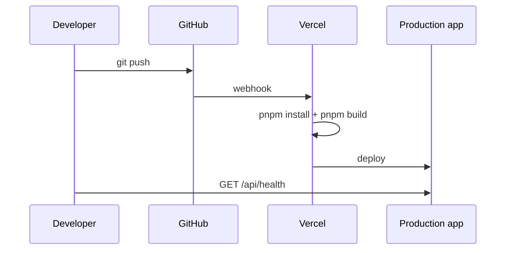

# Deployment

Guía para levantar el proyecto localmente y desplegarlo en Vercel.

## Requisitos

- Node.js moderno con Corepack.
- pnpm vía Corepack.
- Proyecto Supabase.
- Ticket Mercado Público.
- Cuenta Vercel conectada a GitHub.

## Levantar local

```bash
corepack prepare pnpm@10.24.0 --activate
pnpm install
cp .env.example .env.local
pnpm dev
```

Abrir:

```text
http://localhost:3000
```

## Variables de entorno locales

Archivo:

```text
.env.local
```

Contenido:

```bash
MERCADO_PUBLICO_TICKET=...
NEXT_PUBLIC_SUPABASE_URL=https://tu-proyecto.supabase.co
NEXT_PUBLIC_SUPABASE_ANON_KEY=...
SUPABASE_SERVICE_ROLE_KEY=...
MERCADO_PUBLICO_DAILY_LIMIT=10000
MERCADO_PUBLICO_CACHE_TTL_MINUTES=60
ADMIN_API_KEY=...
```

Reiniciar `pnpm dev` después de cambiar variables.

## Supabase setup

1. Crear proyecto Supabase.
2. Ir a SQL Editor.
3. Ejecutar `lib/supabase/schema.sql`.
4. Confirmar `/api/health`.

Tablas creadas:

- `profiles`
- `favorite_tenders`
- `tender_alerts`
- `licitaciones_cache`
- `api_request_log`

El SQL es idempotente:

- `create table if not exists`
- `create index if not exists`
- `drop policy if exists`
- `grant`

## Vercel setup

1. Crear proyecto en Vercel.
2. Importar repositorio GitHub.
3. Framework: Next.js.
4. Package manager: pnpm.
5. Build command:

```bash
pnpm build
```

6. Agregar variables para Production y Preview.

## GitHub integration

Flujo recomendado:

```bash
git add .
git commit -m "feat: ..."
git push origin master
```

Vercel despliega automáticamente cada push a la rama conectada.

## Deploy automático



## Health check

Después de deploy:

```bash
curl "https://tu-dominio.vercel.app/api/health"
```

Debe responder:

```json
{
  "ok": true,
  "missingEnvVars": [],
  "cacheEnabled": true
}
```

## Admin API usage

```bash
curl "https://tu-dominio.vercel.app/api/admin/api-usage" \
  -H "x-admin-api-key: $ADMIN_API_KEY"
```

## Troubleshooting

### Variables invertidas de Supabase

Correcto:

```bash
NEXT_PUBLIC_SUPABASE_URL=https://xxxx.supabase.co
NEXT_PUBLIC_SUPABASE_ANON_KEY=ey...
```

Incorrecto:

```bash
NEXT_PUBLIC_SUPABASE_URL=ey...
NEXT_PUBLIC_SUPABASE_ANON_KEY=https://xxxx.supabase.co
```

### Permission denied 42501

Ejecutar `schema.sql` actualizado. Debe incluir grants para `service_role`.

### Build local EPERM en `.next`

En Windows/OneDrive puede quedar bloqueado `.next`.

```bash
taskkill //F //IM node.exe
rm -rf .next
corepack pnpm build
```

Si persiste, mover el repo fuera de OneDrive.

### Health ok false pero variables presentes

Revisar:

- SQL ejecutado en el proyecto correcto.
- `SUPABASE_SERVICE_ROLE_KEY` corresponde al mismo proyecto.
- Reiniciar servidor local después de editar `.env.local`.

### Vercel build error por env/config

Revisar variables en Production y Preview. No usar valores `undefined` en config.
