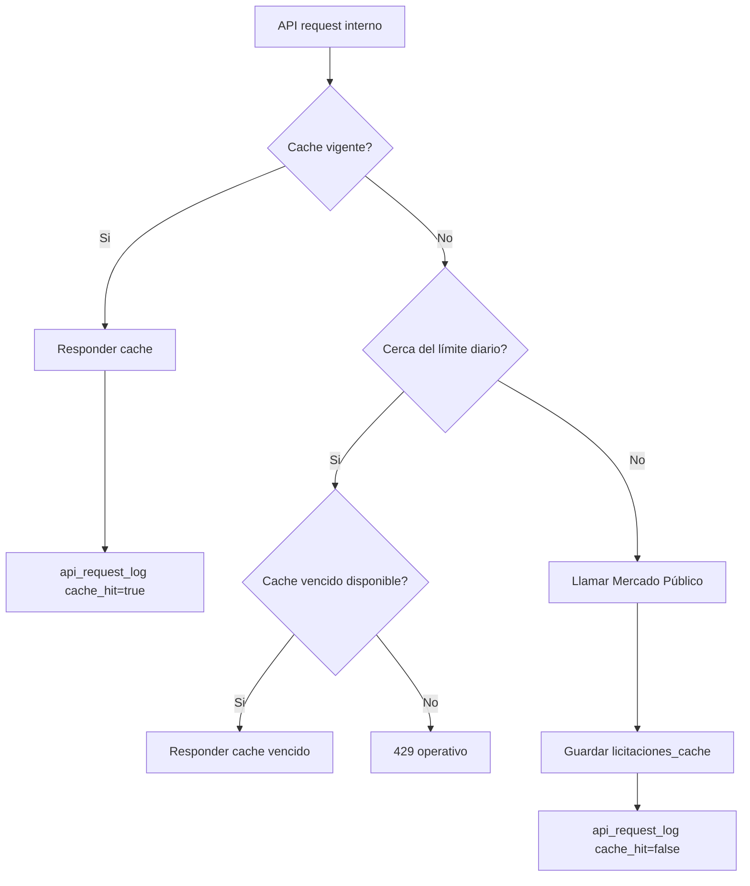

# Rate limiting y cache defensivo

La API de Mercado Público opera con ticket y límite diario de solicitudes. La aplicación no debe consumir ese cupo innecesariamente, especialmente cuando múltiples usuarios consultan los mismos listados.

## Objetivos

- Proteger `MERCADO_PUBLICO_TICKET`.
- Reducir llamadas externas.
- Responder rápido desde cache.
- Mantener visibilidad operacional.
- Evitar caída total si se alcanza el límite.

## Componentes



## Variables

```bash
MERCADO_PUBLICO_DAILY_LIMIT=10000
MERCADO_PUBLICO_CACHE_TTL_MINUTES=60
SUPABASE_SERVICE_ROLE_KEY=...
```

## Cache

Tabla: `public.licitaciones_cache`.

Campos clave:

- `cache_key`
- `resource`
- `params`
- `payload`
- `fetched_at`
- `expires_at`

El `ticket` nunca se guarda en `params` ni en el `cache_key`.

## Registro de llamadas

Tabla: `public.api_request_log`.

Registra:

- `provider`
- `resource`
- `params`
- `params_hash`
- `status`
- `cache_hit`
- `error_message`
- `created_at`

La cuota diaria considera solo:

```sql
provider = 'mercado_publico'
and cache_hit = false
and created_at >= inicio_del_dia
```

## Control de llamadas

Antes de una llamada externa:

1. Revisar cache vigente.
2. Si existe, devolverlo y registrar cache hit.
3. Si no existe, contar llamadas externas del día.
4. Si el uso supera el 95% del límite, no llamar.
5. Intentar cache vencido.
6. Si no existe cache vencido, devolver 429.

## Fallback a cache vencido

Se usa cuando:

- La cuota está cerca del límite.
- Mercado Público falla.
- Existe una respuesta previa para los mismos parámetros.

Esto permite degradación controlada en vez de romper la experiencia.

## Health endpoint

```text
GET /api/health
```

No llama a Mercado Público. Devuelve:

- `ok`
- `missingEnvVars`
- `mercadoPublicoDailyLimit`
- `mercadoPublicoRequestsToday`
- `cacheEnabled`
- estado Supabase

## Admin usage endpoint

```text
GET /api/admin/api-usage
```

Headers:

```bash
x-admin-api-key: $ADMIN_API_KEY
```

o:

```bash
Authorization: Bearer $ADMIN_API_KEY
```

Devuelve:

- llamadas externas hoy
- cache hits hoy
- errores hoy
- últimas 20 llamadas

## Buenas prácticas

- No hacer health checks que consuman cuota externa.
- Usar cache para dashboard y consultas repetidas.
- Mantener TTL configurable.
- Revisar `/api/admin/api-usage` después de publicar nuevas funcionalidades.
- No exponer `SUPABASE_SERVICE_ROLE_KEY`.
- No guardar tickets en logs ni cache.

## Lecciones aprendidas

- Supabase RLS no reemplaza grants; ambos importan.
- En local algunas consultas `HEAD` pueden fallar con errores poco claros; se prefirió `GET + limit(1)` para health.
- La paginación en la UI evita renderizar cientos de cards aunque el origen externo no pagine.
- Vercel y local pueden diferir por variables y filesystem.
